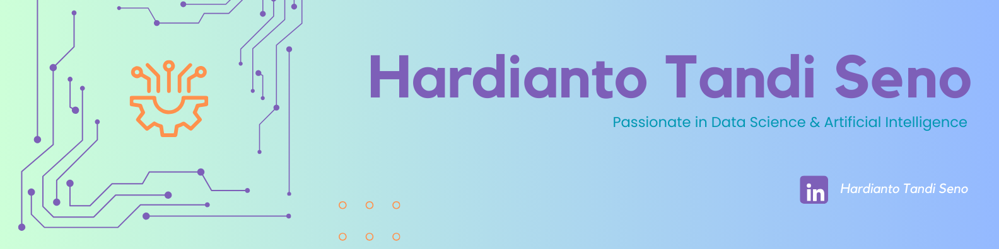

    

        
    

    

        
    

    

        
    

    

         
        <h2 align="center">About Myself</h2>
        

          Hi, My Name is Hardianto Tandi Seno. Have Interesting in Data Science & Artificial Intelligence 
        

        

          I'am final year of undergraduate Informatics Engineering student at Hasanuddin University & has undergone several trainings related to the world of Data Science and AI, such as the Independent Study of AI Computer Vision Startup Campus Batch 4, Fresh Graduate Academy (FGA) from KOMINFO related to Huawei AI, Training at Datacamp (Data Analyst, Data Science, SQL), and FGA Binar on the topic of Data Science. 
        

        

           In addition, I also had an internship in one of the matching fund programs of Kedaireka related to the topic of implementing IoT and AI in Samata Green House which focuses on hydroponics. My main jobdesk during the internship was assembling IoT devices used to be able to read sensors, integrating sensor reading results into datasets and graphs on Raspberry PI and building model predictions on sensor reading results for automatic actuator activation according to environmental conditions
        

        <h2 align="center">Learning Interest</h2>
        

          
          
          
          
          
          
        

        

          
          
          
          
          
        

        

          
          
        

    

